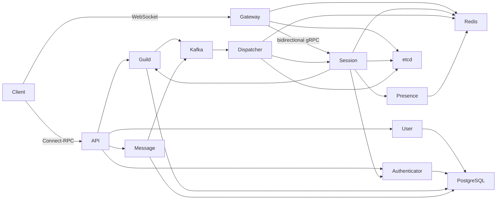

# Cordis

[简体中文](README.zh-CN.md) | English

Cordis is a realtime communication backend built around guilds, channels, and
messages. It uses Go microservices, gRPC for internal communication,
Connect-RPC for the public HTTP API, WebSocket for realtime clients, and Kafka
for domain-event delivery.

The project is under active development. The current implementation includes
authentication, users, guild membership and permissions, channel metadata,
messages, resumable realtime sessions, presence, and event dispatch.

## Architecture



- API exposes the public Connect-RPC interface.
- Gateway is a stateless WebSocket transport adapter.
- Session owns logical sessions, subscriptions, sequence numbers, and in-memory
  replay buffers.
- Dispatcher consumes Kafka events and routes them to Session nodes.
- etcd stores the leased, low-cardinality Session-node directory.
- Redis stores resume ownership, aggregate realtime routes, and Presence state.
- PostgreSQL is owned independently by the domain services.

Production deployments are intended to use Redis Cluster and an etcd cluster.
The single endpoints in repository configuration files are local-development
defaults.

## Services

| Service | Default port | Responsibility |
| --- | ---: | --- |
| User | 3000 | Users, profiles, and password verification |
| Authenticator | 3001 | Registration, login, tokens, and auth sessions |
| Message | 3002 | Messages, replies, attachments, and mentions |
| Presence | 3003 | User-device presence aggregation |
| Guild | 3005 | Guilds, members, roles, channels, and permissions |
| Session | 3006 | Stateful realtime sessions and event fanout |
| API | 8080 | Public Connect-RPC API |
| Gateway | 8081 | WebSocket gateway |
| Dispatcher | — | Kafka-to-Session event delivery |

## Requirements

- Go 1.26 or later, following the version declared in `go.mod`
- PostgreSQL
- Redis
- etcd
- Kafka
- Buf and the configured protobuf generators when regenerating protocol code

## Development

Install dependencies and run the standard checks:

```bash
go mod download
make lint
make test
go build ./...
go vet ./...
```

Regenerate protobuf outputs after changing files under `proto/`:

```bash
make generate
```

Generated files under `gen/` should not be edited manually.

## Local startup

Start PostgreSQL, Redis, etcd, and Kafka, then adjust the YAML files under
`services/<name>/v1/etc/` for the local environment.

Authenticator requires token secrets:

```bash
export CORDIS_ACCESS_TOKEN_SECRET='development-access-secret'
export CORDIS_REFRESH_TOKEN_SECRET='development-refresh-secret'
```

TOTP two-factor authentication also requires an independent AES-256-GCM key,
encoded as 32 random bytes in Base64:

```bash
export CORDIS_TOTP_ENCRYPTION_KEY='...'
```

Do not reuse a JWT key or commit this value to configuration or logs.

Apply the PostgreSQL migrations:

```bash
go run ./services/user/v1/cmd/migrate -c services/user/v1/etc/config.yaml
go run ./services/authenticator/v1/cmd/migrate -c services/authenticator/v1/etc/config.yaml
go run ./services/guild/v1/cmd/migrate -c services/guild/v1/etc/config.yaml
go run ./services/message/v1/cmd/migrate -c services/message/v1/etc/config.yaml
```

Start the domain and state services first, followed by the edge and dispatch
services:

```text
User → Authenticator → Guild → Message → Presence → Session
API → Gateway → Dispatcher
```

For example:

```bash
go run ./services/user/v1 -c services/user/v1/etc/config.yaml
go run ./services/session/v1 -c services/session/v1/etc/config.yaml
go run ./services/gateway/v1 -c services/gateway/v1/etc/config.yaml
```

Run each long-lived service in a separate process. Session's advertised address
must be reachable by both Gateway and Dispatcher.

## Documentation

- [Architecture and design](docs/en/README.md)
- [System overview](docs/en/overview.md)
- [Service catalog](docs/en/services.md)
- [Realtime system](docs/en/realtime.md)
- [Data storage and events](docs/en/data-and-events.md)
- [APIs, protocols, and errors](docs/en/protocols-and-errors.md)
- [Operations and development](docs/en/operations-and-development.md)
- [Current limitations](docs/en/limitations.md)

The documentation describes implemented behavior. Planned or incomplete
features are explicitly listed as limitations.
