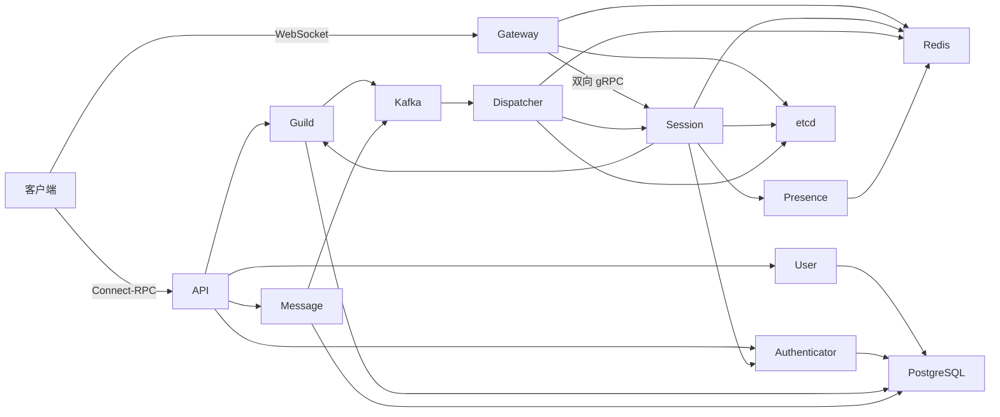

# Cordis

简体中文 | [English](README.md)

Cordis 是一个围绕 Guild、频道和消息构建的实时通信后端。项目采用 Go
微服务架构，内部服务使用 gRPC，对外 HTTP API 使用 Connect-RPC，实时客户端使用
WebSocket，领域事件通过 Kafka 投递。

项目仍在积极开发中。目前已经实现认证、用户、Guild 成员与权限、频道元数据、消息、
可恢复实时 Session、Presence 和事件分发等核心能力。

## 架构



- API 提供公开 Connect-RPC 接口。
- Gateway 是无状态的 WebSocket 传输适配器。
- Session 持有逻辑会话、订阅、sequence 和内存回放缓冲区。
- Dispatcher 消费 Kafka 事件并将其路由到 Session 节点。
- etcd 保存低基数、带租约的 Session 节点目录。
- Redis 保存 Resume owner、实时聚合路由和 Presence 状态。
- 各领域服务分别拥有自己的 PostgreSQL 数据。

生产部署目标是 Redis Cluster 与 etcd Cluster。仓库配置中的单节点地址仅用于本地开发。

## 服务

| 服务 | 默认端口 | 职责 |
| --- | ---: | --- |
| User | 3000 | 用户、资料和密码校验 |
| Authenticator | 3001 | 注册、登录、令牌和认证 Session |
| Message | 3002 | 消息、回复、附件和提及 |
| Presence | 3003 | 用户多设备在线状态聚合 |
| Guild | 3005 | Guild、成员、角色、频道和权限 |
| Session | 3006 | 有状态实时 Session 与事件 fanout |
| API | 8080 | 公开 Connect-RPC API |
| Gateway | 8081 | WebSocket 网关 |
| Dispatcher | — | Kafka 到 Session 的事件分发 |

## 环境要求

- Go 1.26 或更高版本，以 `go.mod` 声明为准
- PostgreSQL
- Redis
- etcd
- Kafka
- 修改 Proto 并重新生成代码时需要 Buf 和配置中的 protobuf 生成器

## 开发

安装依赖并运行标准检查：

```bash
go mod download
make lint
make test
go build ./...
go vet ./...
```

真实依赖测试使用 `integration` tag：

```bash
make test-integration
```

这些测试通过 Testcontainers 管理基础设施（需要 Docker），不依赖开发机上已有服务。

修改 `proto/` 下的协议后重新生成代码：

```bash
make generate
```

`gen/` 下是生成产物，不应手工修改。

## 本地启动

先启动 PostgreSQL、Redis、etcd 和 Kafka，再根据本地环境调整
`services/<name>/v1/etc/` 下的 YAML 配置。

仓库提供固定版本的本地依赖编排：

```bash
make compose-up
```

它会暴露配置默认使用的 `5432`、`6379`、`9092` 与 `2379` 端口。停止服务但保留本地数据请使用 `make compose-down`。

Authenticator 需要令牌密钥：

```bash
export CORDIS_ACCESS_TOKEN_SECRET='development-access-secret'
export CORDIS_REFRESH_TOKEN_SECRET='development-refresh-secret'
```

启用 Authenticator 的 TOTP 两步验证还需要独立的 AES-256-GCM 密钥（Base64 编码的 32 字节随机值）：

```bash
export CORDIS_TOTP_ENCRYPTION_KEY='...'
```

该密钥不得与 JWT 密钥复用，也不应提交到配置文件或日志中。

执行 PostgreSQL migration：

```bash
go run ./services/user/v1/cmd/migrate -c services/user/v1/etc/config.yaml
go run ./services/authenticator/v1/cmd/migrate -c services/authenticator/v1/etc/config.yaml
go run ./services/guild/v1/cmd/migrate -c services/guild/v1/etc/config.yaml
go run ./services/message/v1/cmd/migrate -c services/message/v1/etc/config.yaml
```

当 `registration.mode` 设为 `invite_only` 时，使用内部 CLI 创建和管理一次性注册邀请：

```bash
go run ./services/authenticator/v1/cmd/invite -c services/authenticator/v1/etc/config.yaml create -count 10 -ttl 168h
go run ./services/authenticator/v1/cmd/invite -c services/authenticator/v1/etc/config.yaml create -email user@example.com -ttl 24h
go run ./services/authenticator/v1/cmd/invite -c services/authenticator/v1/etc/config.yaml list
go run ./services/authenticator/v1/cmd/invite -c services/authenticator/v1/etc/config.yaml revoke -id <invite-id>
```

原始邀请码只会由 `create` 输出一次，数据库中仅保存其 SHA-256 哈希。

建议先启动领域服务和有状态服务，再启动边缘服务与分发服务：

```text
User → Authenticator → Guild → Message → Presence → Session
API → Gateway → Dispatcher
```

例如：

```bash
go run ./services/user/v1 -c services/user/v1/etc/config.yaml
go run ./services/session/v1 -c services/session/v1/etc/config.yaml
go run ./services/gateway/v1 -c services/gateway/v1/etc/config.yaml
```

每个常驻服务需要运行在独立进程中。Session 的 advertised address 必须能被 Gateway 和
Dispatcher 访问。

需要一次启动完整的前端联调环境时，使用独立的
[本地 Compose 编排](deploy/compose/README.zh-CN.md)。它包含全部业务服务、基础设施、
数据库迁移、Kafka topic、MinIO bucket，以及独立的 HTTP API 和 WebSocket 入口。

## 文档

- [架构与设计](docs/zh-CN/README.md)
- [系统总览](docs/zh-CN/overview.md)
- [服务目录](docs/zh-CN/services.md)
- [实时系统](docs/zh-CN/realtime.md)
- [数据存储与事件](docs/zh-CN/data-and-events.md)
- [API、协议与错误](docs/zh-CN/protocols-and-errors.md)
- [配置、可观测性与开发](docs/zh-CN/operations-and-development.md)
- [当前限制与演进方向](docs/zh-CN/limitations.md)

文档描述当前已经实现的行为；规划中或尚未完成的能力会明确记录在限制章节。
