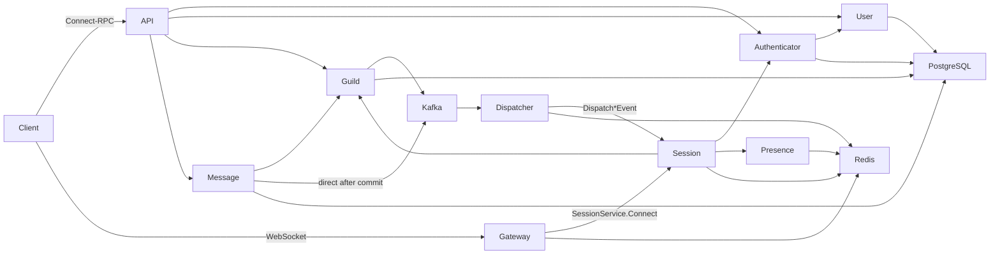

# System Overview

Cordis is a realtime communication backend centered on guilds, channels, and
messages. It uses Go 1.26, gRPC for internal calls, Connect-RPC for the public
HTTP API, and WebSocket for realtime clients.

The API is an edge adapter and owns no domain data. User, Authenticator, Guild,
and Message own their PostgreSQL data. Gateway is a transport proxy. Session is
stateful and owns logical realtime sessions, subscriptions, and replay buffers.
Dispatcher converts Kafka domain events into calls to the relevant Session
nodes. Presence stores online state in Redis.

Database transactions are the business consistency boundary. Message and Guild
both publish directly to Kafka on a best-effort basis after commit. A publish
failure is logged and does not roll back committed business data, so realtime
delivery is not required for a successful business RPC.

Repository layout:

- `proto/api`: public API and web code generation;
- `proto/<service>`: internal edition 2023 opaque APIs;
- `services/<service>/v1`: service entrypoints and implementation;
- `pkg`: shared infrastructure and stable event/error definitions;
- `gen`: generated code, never edited manually.
