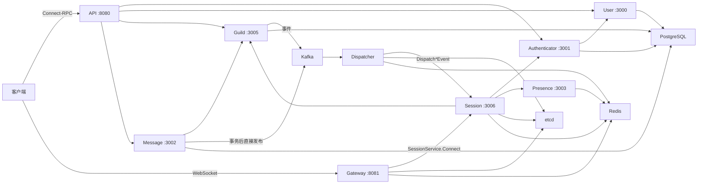

# 系统总览

Cordis 是一个以 Guild、频道和消息为核心的实时通信后端。代码采用 Go 1.26，内部服务主要通过 gRPC 通信，外部 HTTP API 使用 Connect-RPC，实时客户端使用 WebSocket。

## 组件关系

## 核心边界

- API 负责公开协议转换、身份信息传递和公开错误映射，不承载领域数据。
- User、Authenticator、Guild、Message 是领域服务，PostgreSQL 中的数据由各服务分别拥有。
- Gateway 只负责 WebSocket 传输，不持有逻辑 Session 和订阅状态。
- Session 是有状态实时服务，持有逻辑会话、订阅索引和内存回放缓冲区。
- Dispatcher 消费领域事件，借助 Redis 路由到相关 Session 节点。
- etcd 保存带租约的 Session 节点目录；Redis 保存 Resume owner 和用户、Guild、频道的聚合路由。
- Presence 管理在线状态并依赖 Redis。

## 一致性模型

业务写入以 PostgreSQL 事务为边界。Message 和 Guild 都在事务提交后 best-effort 直接写 Kafka；发布失败只记录日志，不回滚已经提交的业务数据。因此数据库成功但事件发布失败时可能丢失实时通知。实时推送不作为业务 RPC 成功的必要条件。

## 代码组织

- `proto/api`：公开 API，生成开放 Go API 和 Connect-Go 代码。
- `proto/<service>`：内部 gRPC 协议，使用 protobuf edition 2023 opaque Go API。
- `services/<service>/v1`：服务入口、配置、依赖、业务逻辑和存储。
- `pkg`：跨服务复用的数据库、Kafka、迁移、错误、密码、ID 和实时事件定义。
- `gen`：由 Buf 生成，不手工修改。
