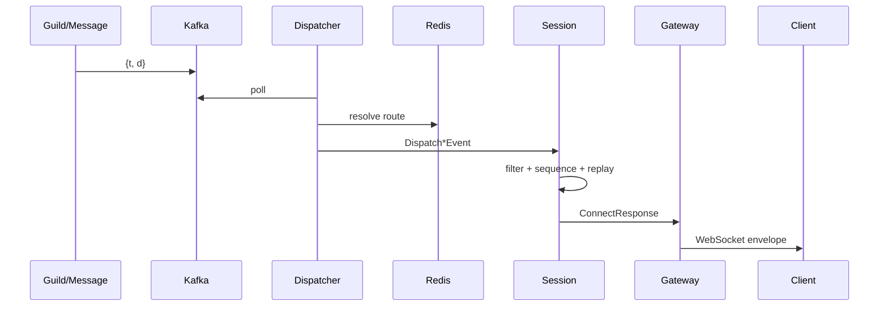

# 实时系统

## 连接生命周期

1. 客户端连接 Gateway WebSocket。
2. Gateway 返回 `op=10` 的 `HELLO`，包含 45 秒心跳间隔。
3. 客户端发送 `IDENTIFY`，或携带 `session_id` 与最后 sequence 发送 `RESUME`。
4. Gateway 从 Redis 选择可用 Session 节点或查找 Session owner。
5. Gateway 建立 `SessionService.Connect` 双向流，并发送首条 `ConnectRequest`。
6. IDENTIFY 成功后 Session 返回 sequence 化的 `READY`；RESUME 成功后重放缺失事件并返回 `RESUMED`。
7. 后续心跳、Presence、订阅和 detach 经同一条流传递。

Gateway 实例身份包含 ID 与 generation，可区分同名进程重启。逻辑 Session 与 WebSocket connection 分离，因此一次断线重连可以绑定到原 Session。

## Sequence、ACK 与回放

只有需要恢复的 dispatch 事件进入回放缓冲区并获得递增 sequence。每个逻辑 Session 最多保存 2048 条；溢出时移动 replay floor。客户端 heartbeat 携带已处理 sequence，Session 单调更新 ACK，并清理不再需要的前缀。

Resume sequence 低于 replay floor、超过服务端 sequence，或 Session 已过期时，Resume 无效，客户端必须重新 IDENTIFY。缓冲区只在内存中，不跨 Session 节点迁移。

## 订阅与权限

IDENTIFY 自动建立用户和 Guild 路由。频道需客户端显式订阅，Session 调用 Guild 的 `AuthorizeGuildChannel` 校验 `VIEW_CHANNEL`。频道权限相关 Guild 事件到达后，Session 会重新授权本节点相关会话；无权会话不再收到对应事件。

成员被踢出或封禁时，事件先投递给当前 Guild 会话，再撤销其 Guild 和相关频道索引。这样客户端能够收到导致订阅失效的最终状态事件。

## Redis 索引

- `session:nodes`：可用节点 ZSET，score 为过期时间。
- `session:nodes:{node_id}`：节点 generation、RPC 地址、状态和过期时间。
- `session:owners:{session_id}`：逻辑 Session 所属节点。
- `gateway:routes:users:{id}:nodes`：用户所在 Session 节点。
- `gateway:routes:guilds:{id}:nodes`：Guild 订阅所在节点。
- `gateway:routes:channels:{id}:nodes`：频道订阅所在节点。

路由成员包含 node ID 与 generation，TTL 和读取时校验共同排除旧进程记录。

## 事件路径

事件在 Dispatcher 重试下是至少一次语义。当前协议没有通用 event ID 去重，因此消费者应能够容忍重复事件。
