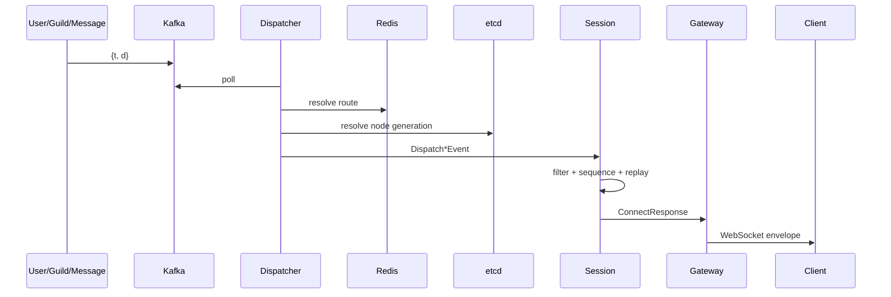

# 实时系统

## 连接生命周期

1. 客户端连接 Gateway WebSocket。
2. Gateway 返回 `op=10`、`t=hello` 的事件，包含 45 秒心跳间隔。
3. 客户端发送 `identify`，或携带 `session_id` 与最后 sequence 发送 `resume`。原生客户端在 `token` 中提供 access token；浏览器并行向 API 获取单次 ticket，并在 `gateway_ticket` 中提供。
4. Gateway 从 etcd 选择可用 Session 节点；Resume 先从 Redis 查找 Session owner，再用 etcd 校验节点 generation。
5. Gateway 建立 `SessionService.Connect` 双向流，并发送首条 `ConnectRequest`。
6. Session 通过 Authenticator 校验 access token 或原子兑换 ticket。
7. IDENTIFY 成功后 Session 返回 sequence 化的 `ready`；RESUME 成功后重放缺失事件并返回 `resumed`。
8. 后续 Presence、detach 和服务端事件经同一条流传递；Gateway 本地处理 `heartbeat`，并批量向 Session 同步 sequence checkpoint。

Gateway 实例身份包含 ID 与 generation，可区分同名进程重启。逻辑 Session 与 WebSocket connection 分离，因此一次断线重连可以绑定到原 Session。

## Presence 设置

客户端可在 `IDENTIFY`（opcode `2`）中设置逻辑 Session 的初始 Presence：

```json
{
  "op": 2,
  "d": {
    "gateway_ticket": "...",
    "device_type": "desktop",
    "status": "online",
    "client_state": "foreground"
  }
}
```

`status` 缺失时默认为 `online`，`client_state` 缺失时默认为 `foreground`。显式提供时，`status` 只接受 `online`、`idle`、`dnd`、`invisible`，`client_state` 只接受 `foreground`、`background`。`offline`、`null`、非字符串、空字符串和未知值均无效；`invisible` 在对其他用户公开的聚合结果中表现为 offline。

连接建立后，客户端发送 opcode `3` 部分更新当前逻辑 Session。缺失字段保留现值，至少必须提供一个字段：

```json
{"op":3,"d":{"status":"idle"}}
{"op":3,"d":{"client_state":"background"}}
{"op":3,"d":{"status":"invisible","client_state":"foreground"}}
```

`status` 通常来自用户的状态选择；`client_state` 应由客户端根据页面可见性、窗口焦点或应用生命周期自动维护。每个设备或页面的逻辑 Session 独立保存这两个值，Presence 服务再聚合用户的所有活动 Session。`RESUME` 保留原逻辑 Session 的值，需要改变时再发送 opcode `3`。

Gateway 对非法输入返回带稳定 code 的 `error` 事件：空更新为 `presence_update_empty`，非法 status 为 `presence_status_invalid`，非法 client state 为 `presence_client_state_invalid`。Session 和 Presence 内部服务也会以 `InvalidArgument` 拒绝绕过 Gateway 的非法值。

`ready` payload 的 `presences` 数组包含用户本人和所有去重后的 DM 对端，但不包含全部 Guild 成员。每项提供 `user_id`、聚合 `status`、`last_seen_at` 和 `version`；WebSocket JSON 中的 ID 与 version 都是十进制字符串。客户端应为每个用户保留已见过的最大 version，仅当后续 `presence.updated` 的 version 更大时应用事件。这样即使 READY 组装期间缓冲的事件与快照代表同一次聚合变化，也不会回退状态。

## Sequence、ACK 与回放

只有需要恢复的 dispatch 事件进入回放缓冲区并获得递增 sequence。每个逻辑 Session 最多保存 2048 条；溢出时移动 replay floor。客户端 heartbeat 携带已处理 sequence，Session 单调更新 ACK，并清理不再需要的前缀。

Resume sequence 低于 replay floor、超过服务端 sequence，或 Session 已过期时，Resume 无效，客户端必须重新 IDENTIFY。缓冲区只在内存中，不跨 Session 节点迁移。

## 路由与权限

IDENTIFY 自动建立用户和 Guild 路由。Dispatcher 按 Guild 将消息路由到候选 Session 节点；Session 通过带 revision 的用户可见性快照过滤，然后投递给该用户的全部本地逻辑 Session。权限事件先记录频道的原可见用户，使受影响快照失效后再以受控并发重建，事件投递给原可见与当前可见用户的并集。重建失败时保持 fail closed，并为当前失效代发送一次带 sequence 的 `session.reconcile`。

成员被踢出或封禁时，事件先投递给当前 Guild 会话，再撤销其 Guild 索引。这样客户端能够收到导致访问失效的最终状态事件。

对于 `user.profile.updated`，Dispatcher 加载共同 Guild、非 block 关系和已有 DM 对端，并始终包含资料所有者的 user route。Session 按接收用户和 event ID 对 Guild 与直接用户路径去重，再投递完整 profile 快照。

## etcd 节点目录与 Redis 索引

- `/cordis/session/nodes/{node_id}`：etcd 租约 key，保存节点 generation、RPC 地址和 ready/draining 状态。
- `session:owners:{session_id}`：逻辑 Session 所属节点。
- `gateway:routes:users:{id}:nodes`：用户所在 Session 节点。
- `gateway:routes:guilds:{id}:nodes`：Guild 成员所在 Session 节点。

路由成员包含 node ID 与 generation。Redis TTL 与 etcd 租约、读取时 generation 校验共同排除旧进程记录。

## 事件路径


```mermaid
sequenceDiagram
    participant Domain as User/Guild/Message
    participant Kafka
    participant Dispatcher
    participant Redis
    participant etcd
    participant Session
    participant Gateway
    participant Client
    Domain->>Kafka: {t, d}
    Dispatcher->>Kafka: poll
    Dispatcher->>Redis: resolve route
    Dispatcher->>etcd: resolve node generation
    Dispatcher->>Session: Dispatch*Event
    Session->>Session: filter + sequence + replay
    Session->>Gateway: ConnectResponse
    Gateway->>Client: WebSocket envelope
```

Dispatcher 为每个领域 topic 使用独立 consumer group 与消费循环，但共享路由和 Session 连接池，因此一个 topic 的积压、重试或 rebalance 不会阻塞其他 topic。事件在 Dispatcher 重试下是至少一次语义。Profile fanout 会按接收用户和 event ID 去重，但当前协议没有通用 event ID 去重，因此其他事件的消费者仍应能够容忍重复。
